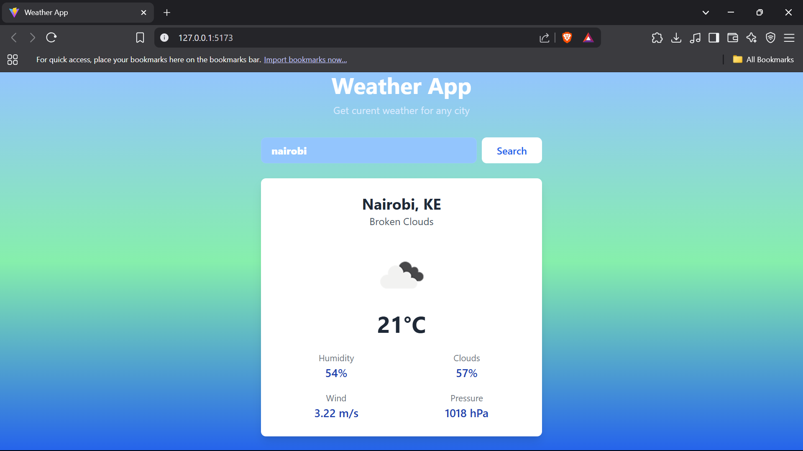

# 🌦️ React Weather App

A clean and simple weather application built with React, Vite, and Tailwind CSS. It allows users to fetch and display current weather information for any city using the OpenWeatherMap API.



## ✨ Features

*   **City Search:** Enter any city name to get its current weather.
*   **Dynamic Data Display:** Shows city name, country, and (can be extended to show) temperature, weather conditions, humidity, wind speed, etc.
*   **Responsive Design:** Styled with Tailwind CSS for a great experience on all device sizes.
*   **Modern Tooling:** Built with Vite for a fast development experience.
*   **Gradient Background:** Visually appealing background that changes.

## 🛠️ Tech Stack

*   **Frontend:** React.js (with Hooks)
*   **Styling:** Tailwind CSS
*   **Build Tool:** Vite
*   **API:** [OpenWeatherMap API](https://openweathermap.org/api)
*   **Package Manager:** pnpm (as indicated by `pnpm-lock.yaml`)

## ⚙️ Prerequisites

Before you begin, ensure you have met the following requirements:

*   [Node.js](https://nodejs.org/) (v16 or higher recommended)
*   [pnpm](https://pnpm.io/installation) (or npm/yarn, though pnpm is used in this project)
*   An API Key from [OpenWeatherMap](https://home.openweathermap.org/users/sign_up). The free tier is sufficient.

## 🚀 Getting Started

Follow these steps to get a local copy up and running.

1.  **Clone the repository:**
    ```bash
    git clone https://your-repository-url.git
    cd weather-app
    ```

2.  **Install dependencies:**
    ```bash
    pnpm install
    ```

3.  **Set up Environment Variables:**
    The application requires an API key from OpenWeatherMap.
    *   Create a `.env` file in the root of your project:
        ```
        touch .env
        ```
    *   Add your OpenWeatherMap API key to the `.env` file:
        ```env
        VITE_OPENWEATHERMAP_API_KEY=your_actual_api_key_here
        
        ```
        *Note: Vite exposes environment variables prefixed with `VITE_` to your client-side code via `import.meta.env`.*

4.  **Run the development server:**
    ```bash
    pnpm dev
    ```
    This will start the Vite development server, usually on `http://localhost:5173` (or the next available port). Open this URL in your browser.

## 📁 Project Structure

Here's an overview of the key files and directories:

```text
weather-app/
├── public/
│   └── vite.svg            # Vite logo (example asset)
├── src/
│   ├── assets/
│   │   └── vue.svg         # Vue logo (example asset, can be removed if not used)
│   ├── styles/
│   │   └── global.css      # Global styles, Tailwind base/components/utilities
│   ├── Weather.jsx         # Main weather component logic and UI
│   └── main.jsx            # Entry point of the React application
├── .gitignore
├── index.html              # Main HTML file
├── package.json
├── pnpm-lock.yaml
├── postcss.config.js       # PostCSS configuration (for Tailwind)
├── tailwind.config.js      # Tailwind CSS configuration
├── vite.config.js          # Vite configuration
└── README.md               # This file


## 🎨 UI Components

*   **`Weather.jsx`**: The main component that handles:
    *   Fetching weather data.
    *   Managing city input state.
    *   Displaying weather information and search form.

## 🔮 Future Enhancements

*   [ ] Display more detailed weather information (e.g., humidity, wind speed, feels like, weather icon).
*   [ ] Implement a 5-day forecast.
*   [ ] Add unit and integration tests.
*   [ ] Allow users to save favorite locations.
*   [ ] Use browser's geolocation to fetch weather for the current location.
*   [ ] Improve error handling and user feedback for API errors or invalid city names.
*   [ ] Add loading states for a smoother UX during API calls.

## 🤝 Contributing

Contributions are welcome! If you have suggestions for improving the app, feel free to:

1.  Fork the Project
2.  Create your Feature Branch (`git checkout -b feature/AmazingFeature`)
3.  Commit your Changes (`git commit -m 'Add some AmazingFeature'`)
4.  Push to the Branch (`git push origin feature/AmazingFeature`)
5.  Open a Pull Request

## 📝 License

This project is licensed under the MIT License - see the `LICENSE` file (you might want to create one) for details. If you don't have a `LICENSE` file, you can simply state:

Distributed under the MIT License.

---

Happy Coding! ☀️
